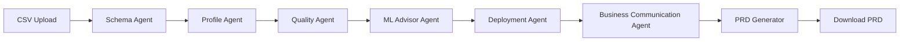

# 🤖 Intelligent Agentic ML Product Planner

[](https://www.python.org/downloads/)
[](https://streamlit.io)
[](https://github.com/stanfordnlp/dspy)
[](LICENSE)

## 📋 Overview

An **end-to-end AI-powered ML product planning system** that transforms raw datasets into production-ready roadmaps. Upload a CSV, and get:
- ✅ Comprehensive data analysis (schema, profiling, quality checks)
- ✅ ML use case recommendations with target variable detection
- ✅ Feature engineering and training strategy
- ✅ Complete MLOps deployment plan (Databricks-focused)
- ✅ Executive communication materials (1-pager, ROI, risk matrix)
- ✅ Production-ready PRD with user stories and acceptance criteria

**Built with DSPy orchestrated agents** - no manual prompt engineering, structured LLM workflows with type-safe signatures.

---

## 🎯 Use Cases

| Who | Use Case | Value |
|-----|----------|-------|
| **Product Managers** | Generate ML feasibility assessments | Turn 2-week scoping into 10-minute analysis |
| **Consultants** | Accelerate RFP responses | Standardized, professional deliverables |
| **Data Scientists** | Get deployment roadmaps | Bridge gap from model to production |
| **Executives** | Understand ML investments | Clear ROI, timelines, and team requirements |

---

## 🏗️ Architecture

### **System Workflow**
```
CSV Upload → [6 Agentic Layers] → PRD Generation → Download
```

### **Agent Pipeline**



### **Component Breakdown**

| Agent | Purpose | Inputs | Outputs |
|-------|---------|--------|---------|
| **Schema Agent** | Analyze data structure | Raw DataFrame | Column types, nulls, cardinality, business interpretations |
| **Profile Agent** | Statistical profiling | DataFrame | Distributions, correlations, outliers, categorical insights |
| **Quality Agent** | Data quality checks | DataFrame | Quality issues (critical/warnings), validation report |
| **ML Advisor Agent** | ML strategy | Schema + Profile + Quality | Use case detection, target variable, feature engineering plan |
| **Deployment Agent** | MLOps roadmap | ML recommendations | Infrastructure setup, team sizing, timelines, costs, monitoring |
| **Business Communication Agent** | Executive materials | All previous outputs | 1-pager, risk matrix, ROI, stakeholder talking points |
| **PO Agent** | PRD generation | All agents | Comprehensive Product Requirements Document |

### **Tech Stack**

- **Orchestration**: [DSPy](https://github.com/stanfordnlp/dspy) - Type-safe LLM workflows
- **LLM**: OpenAI GPT-4 (configurable to other providers)
- **Frontend**: Streamlit - Single-page reactive UI
- **Data Processing**: Pandas, NumPy
- **State Management**: Streamlit session state (prevents redundant agent runs)

---

## 📂 Project Structure

```
agentic-data-analyst/
├── agents/                          # DSPy agent implementations
│   ├── schema_agent.py              # Data structure analysis
│   ├── profile_agent.py             # Statistical profiling
│   ├── quality_agent.py             # Data quality checks
│   ├── ml_advisor_agent.py          # ML use case detection
│   ├── deployment_agent.py          # MLOps deployment planning
│   ├── business_communication_agent.py  # Executive summaries
│   ├── po_agent.py                  # PRD generation
│   └── supervisor.py                # Agent orchestration layer
├── signatures/                      # DSPy signature definitions
│   └── dspy_signatures.py           # Input/output schemas for all agents
├── app.py                           # Streamlit UI entry point
├── config.py                        # Environment config loader
├── dspy_init.py                     # DSPy LLM initialization
├── requirements.txt                 # Python dependencies
├── Makefile                         # Development commands
├── .env.example                     # Template for API keys
└── README.md                        # This file
```

---

## 🚀 Quick Start

### **Prerequisites**
- Python 3.11+ ([Download](https://www.python.org/downloads/))
- `uv` package manager ([Install guide](https://github.com/astral-sh/uv)) or use `pip`
- OpenAI API key ([Get one here](https://platform.openai.com/api-keys))

### **Installation**

#### **Option 1: Using `uv` (Recommended)**
```bash
# Clone repository
git clone https://github.com/your-org/agentic-data-analyst.git
cd agentic-data-analyst

# Create virtual environment and install dependencies
uv sync

# Activate environment
source .venv/bin/activate  # Linux/Mac
# or
.venv\Scripts\activate     # Windows
```

#### **Option 2: Using `pip`**
```bash
# Clone repository
git clone https://github.com/your-org/agentic-data-analyst.git
cd agentic-data-analyst

# Create virtual environment
python -m venv .venv
source .venv/bin/activate  # Linux/Mac
# or
.venv\Scripts\activate     # Windows

# Install dependencies
pip install -r requirements.txt
```

### **Configuration**

1. **Create `.env` file**:
   ```bash
   cp .env.example .env
   ```

2. **Add your OpenAI API key** to `.env`:
   ```env
   OPENAI_API_KEY=sk-proj-xxxxxxxxxxxxxxxxxxxxx
   OPENAI_MODEL=gpt-4  # or gpt-4-turbo, gpt-3.5-turbo
   ```

### **Run the Application**

```bash
# Using Makefile (recommended)
make run

# Or directly
streamlit run app.py
```

The app opens at `http://localhost:8501`

---

## 📖 Usage Guide

### **Step 1: Upload Dataset**
- Supports CSV files (UTF-8 or Latin-1 encoding)
- No row/column limits, but larger files take longer
- Sample datasets: [Kaggle Superstore](https://www.kaggle.com/datasets/vivek468/superstore-dataset-final)

### **Step 2: Run Analysis**
- Click **"Get ML Product Strategy"**
- Wait 30-90 seconds for all 6 agents to execute
- Results display in collapsible sections

### **Step 3: Review Outputs**
- **Schema Analysis**: Column types, business interpretations
- **Statistical Profile**: Distributions, correlations
- **Quality Report**: Data issues prioritized by severity
- **ML Recommendations**: Use case, target variable, feature plan
- **Deployment Strategy**: Infrastructure, team, timeline, costs
- **Business Communication**: Executive summary, ROI, risks

### **Step 4: Generate PRD**
- Review all analysis sections
- Click **"Generate PRD"** button
- Wait 20-30 seconds for PRD synthesis
- Download as markdown file

---

## 🛠️ Development

### **Makefile Commands**

```bash
make install    # Install dependencies (uv or pip)
make run        # Start Streamlit app
make test       # Run pytest suite
make lint       # Code quality checks (optional, if configured)
make clean      # Remove cache files
```

### **Running Tests**

```bash
# Run all tests
pytest

# Run with coverage
pytest --cov=agents --cov=signatures

# Run specific test file
pytest tests/test_schema_agent.py -v
```

### **Adding New Agents**

1. **Define signature** in `signatures/dspy_signatures.py`:
   ```python
   class MyNewAgentSignature(dspy.Signature):
       input_field = dspy.InputField(desc="Description")
       output_field = dspy.OutputField(desc="Description")
   ```

2. **Create agent** in `agents/my_new_agent.py`:
   ```python
   import dspy
   from signatures.dspy_signatures import MyNewAgentSignature

   class MyNewAgent:
       def __init__(self):
           self.processor = dspy.ChainOfThought(MyNewAgentSignature)
       
       def analyze(self, input_data):
           result = self.processor(input_field=input_data)
           return {'output': result.output_field}
   ```

3. **Integrate in supervisor** (`agents/supervisor.py`):
   ```python
   from agents.my_new_agent import MyNewAgent
   
   # In __init__
   self.my_new_agent = MyNewAgent()
   
   # In analyze_dataset
   new_results = self.my_new_agent.analyze(previous_results)
   ```

4. **Update UI** in `app.py` to display results

---

## 🔧 Configuration

### **Environment Variables**

| Variable | Required | Default | Description |
|----------|----------|---------|-------------|
| `OPENAI_API_KEY` | ✅ Yes | - | OpenAI API authentication |
| `OPENAI_MODEL` | No | `gpt-4` | Model to use (`gpt-4-turbo`, `gpt-3.5-turbo`) |

### **DSPy Configuration**

Edit `dspy_init.py` to change LLM provider:

```python
# Switch to Azure OpenAI
lm = dspy.AzureOpenAI(
    api_key=os.getenv("AZURE_OPENAI_KEY"),
    deployment_id="gpt-4",
    api_version="2023-12-01-preview"
)

# Switch to Anthropic Claude
lm = dspy.Claude(
    api_key=os.getenv("ANTHROPIC_API_KEY"),
    model="claude-3-opus-20240229"
)
```

---

## 🧪 Testing Strategy

### **Test Coverage**

- **Unit Tests**: Individual agent logic (`tests/agents/`)
- **Integration Tests**: Multi-agent workflows (`tests/integration/`)
- **Signature Tests**: DSPy input/output validation (`tests/signatures/`)

### **Running Specific Tests**

```bash
# Test schema agent
pytest tests/agents/test_schema_agent.py

# Test with verbose output
pytest -v -s

# Test with markers
pytest -m "not slow"
```

---

## 📊 Performance & Costs

### **Execution Time**
- Full analysis (6 agents): **30-90 seconds**
- PRD generation: **20-40 seconds**
- Total tokens per run: ~15,000-25,000 (varies by dataset size)

### **API Costs (Estimate)**
- **GPT-4**: ~$0.30-0.60 per analysis
- **GPT-4-Turbo**: ~$0.15-0.30 per analysis
- **GPT-3.5-Turbo**: ~$0.05-0.10 per analysis

*Costs based on OpenAI pricing as of Jan 2025. Actual costs vary by dataset complexity.*

---

## 🤝 Contributing

We welcome contributions! Please follow these steps:

1. **Fork the repository**
2. **Create a feature branch**: `git checkout -b feature/amazing-feature`
3. **Make changes and test**: `pytest`
4. **Commit**: `git commit -m "Add amazing feature"`
5. **Push**: `git push origin feature/amazing-feature`
6. **Open Pull Request**

### **Code Style**
- Follow PEP 8
- Use type hints where possible
- Document functions with docstrings
- Keep agent logic modular and testable

---

## 🐛 Troubleshooting

### **Common Issues**

| Issue | Solution |
|-------|----------|
| `ModuleNotFoundError: No module named 'dspy'` | Run `uv sync` or `pip install -r requirements.txt` |
| `OpenAI API key not found` | Check `.env` file exists and contains `OPENAI_API_KEY` |
| `Streamlit not found` | Activate virtual environment: `source .venv/bin/activate` |
| Agents return errors | Check OpenAI API quota and billing status |
| PRD button doesn't work | Ensure all 6 agents completed successfully |

### **Debug Mode**

Enable verbose logging:
```python
# In dspy_init.py
import logging
logging.basicConfig(level=logging.DEBUG)
```

---

## 📜 License

This project is licensed under the MIT License - see [LICENSE](LICENSE) file for details.

---

## 🙏 Acknowledgments

- **DSPy**: Stanford NLP's framework for building LLM applications
- **Streamlit**: Rapid UI prototyping
- **OpenAI**: GPT-4 API
- **Databricks**: MLOps best practices inspiration

---

## 📞 Support

- **Issues**: [GitHub Issues](https://github.com/your-org/agentic-data-analyst/issues)
- **Discussions**: [GitHub Discussions](https://github.com/your-org/agentic-data-analyst/discussions)
- **Email**: support@yourorg.com

---

## 🗺️ Roadmap

- [ ] Multi-cloud support (AWS SageMaker, Azure ML, GCP Vertex AI)
- [ ] Support for non-tabular data (images, text, time-series)
- [ ] Integration with Jira/Confluence for PRD export
- [ ] Model performance benchmarking module
- [ ] Multi-language PRD generation
- [ ] Self-hosted LLM support (Llama, Mistral)

---

**Built with ❤️ by Ashish Trivedi**